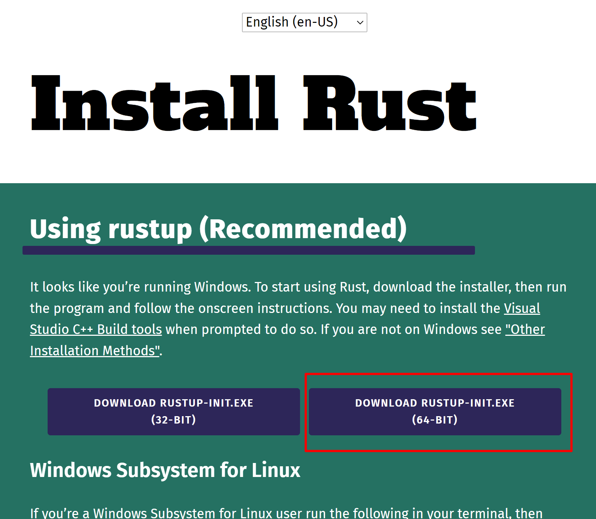
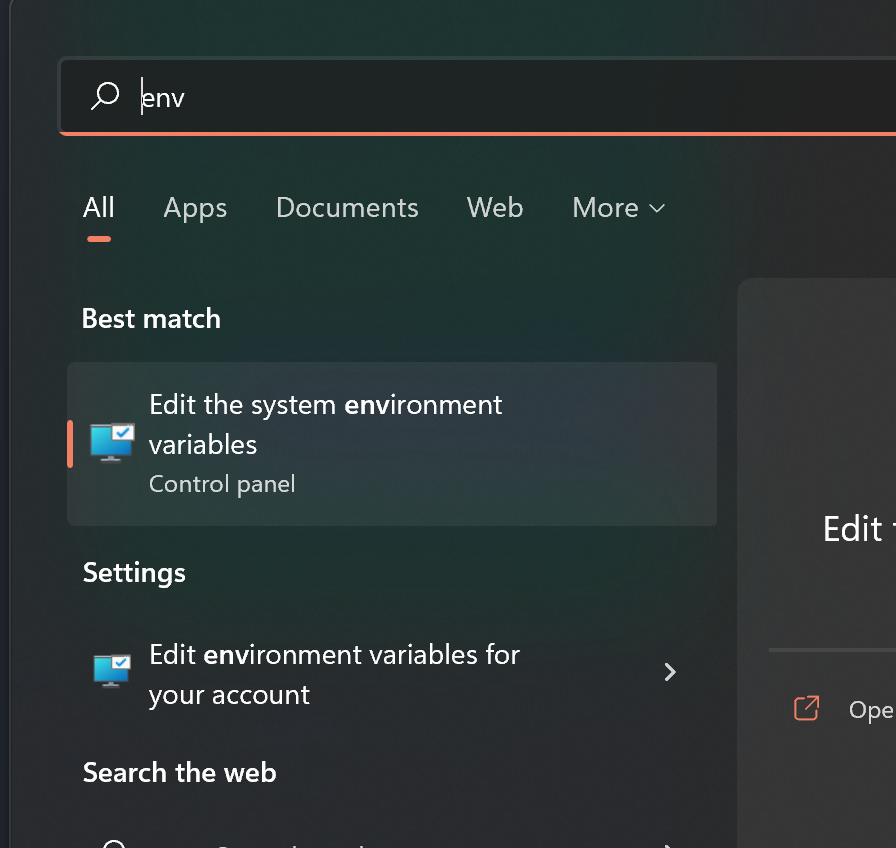
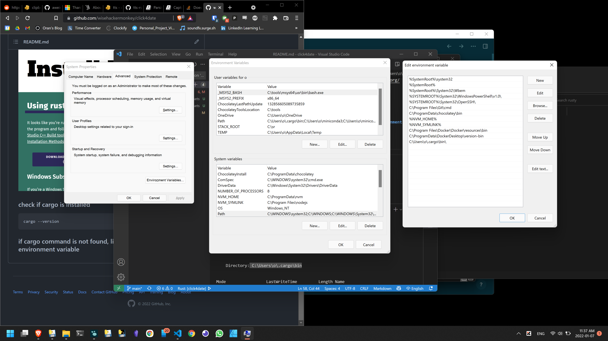
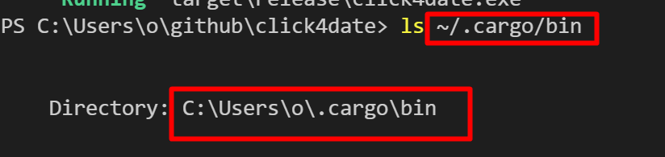
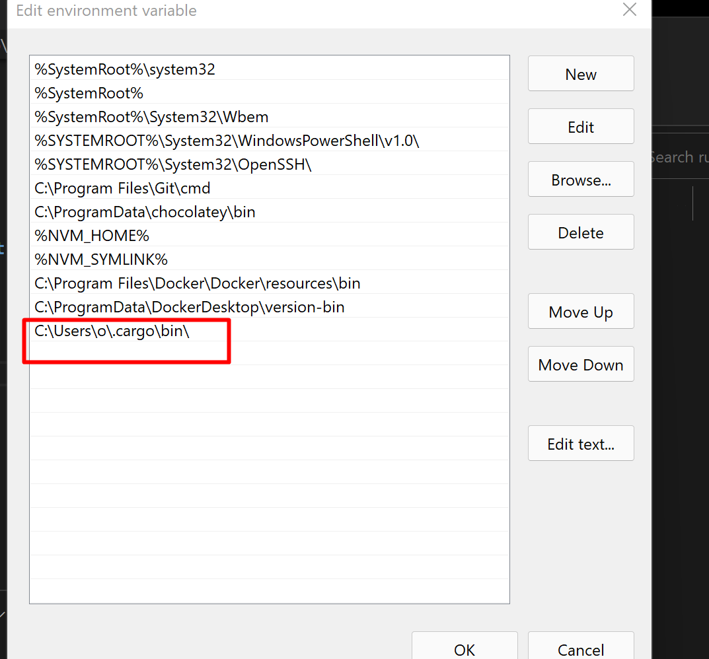
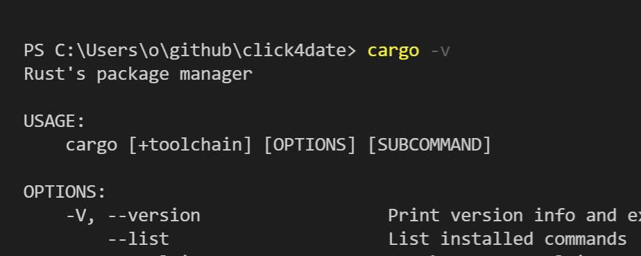

# click4date


### click for date
## This a really simple app that copys the current date to your clipbard


## the date is copied to the clipbard in the format: YYYYMMDD
# Download Here:
https://github.com/wisehackermonkey/click4date/releases/
# Code
## thats it. thats the whole program.
```rust
extern crate clipboard;

use clipboard::ClipboardProvider;
use clipboard::ClipboardContext;

use chrono::{Datelike, Utc};
fn clipboard_paste(text: &str) {
    let mut ctx: ClipboardContext = ClipboardProvider::new().unwrap();
     ctx.set_contents(text.to_owned()).unwrap();
}
fn formate_date() -> String{
    let now = Utc::now();
    return format!("{:?}{:0>width$}{:0>width$}", now.year(), now.month(), now.day(),width=2);
}
fn main(){
    let current_date = formate_date();
    clipboard_paste(&current_date);
}
```
### pretty simple eh?.
## the python version 
```python
# 20180307
import datetime
import pyperclip
import time
d = datetime.datetime.now()

day = str(d.day).rjust(2,"0")
month = str(d.month).rjust(2,"0")
year = d.year 

pyperclip.copy("{}{}{}".format(year,month,day) )
```
# Pro tips:
### add the exe to your taskbar to have easy access to the app

# how to build from scratch (windows):


### install rust
[Install Rust - Rust Programming Language](https://www.rust-lang.org/tools/install)

### check if cargo is installed
```bash
cargo --version
```
### if cargo command is not found, link it to windows path environment variable 




# add to path `ls ~/.cargo/bin ` (powershell)
### in my case its ` C:\Users\o\.cargo\bin`



### run `cargo -v` 


### success!

# Compile the program
```bash
cargo build
```
